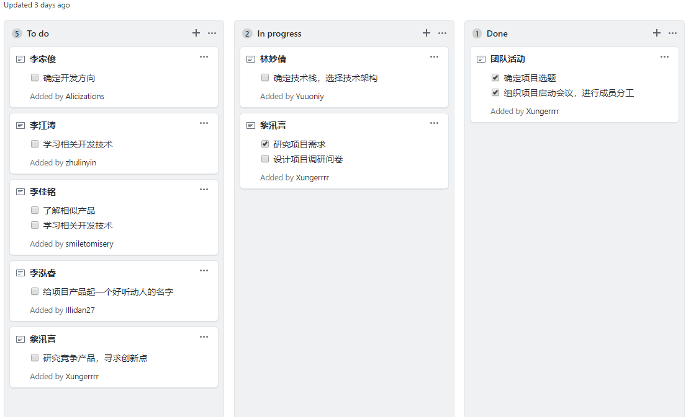

系统分析与设计 作业 2
<!-- more --> 

## 简答题

- **用简短的语言给出对分析、设计的理解。**

分析关注的是对问题和需求的调查研究，而不是解决方案。即做对的事情

设计关注的是满足需求的概念上的解决方案，而不是其实现。即把事情做对。

- **用一句话描述面向对象的分析与设计的优势。**

面向对象的分析与设计能够紧密结合现实，并且专门负责分析问题和负责实现的人可以使用通用的模型符号进行交流。

- **简述 UML（统一建模语言）的作用。考试考哪些图？**

UML 把现实中的问题抽象成面向对象的解决方案，用来指导工程。

考试考：

- 用例图

- 静态图

  - 类图
  - 对象图
  - 包图

- 行为图

  - 交互图
  - 状态图
  - 活动图

- 实现图

  - 构件图
  - 部署图

  

- **从软件本质的角度，解释软件范围（需求）控制的可行性**

软件的本质特性为复杂性、一致性、可变性、不可见性。

通过软件需求分析把软件计划期间建立的软件可行性分析求精和细化，分析各种可能的解法，并且分配给各个软件元素，从而控制软件的范围。由于软件本身的复杂性、不可预见性，可变性。需求和开发范围往往是模糊的，这形成软件产品与其他产品不同的开发过程。所以更需要对软件需求的控制，对目标系统提出完整而清楚的要求。

软件工程是软件项目开发、运维与维护过程中最佳实践的总结，关注的都是常见场景的关键工作方法，掌握 20% 软件工程基础知识有助于提升 80% 项目的效率和质量。项目是综合性的任务，2/8法则会在许多地方用上，如需求获取，软件测试等方面。细化 20% 有效需求，可满足 80% 客户需要。正确发现并做好这 20% 正确的事情，需要熟练的业务能力、敏锐的观察能力、果断的执行能力，排除干扰，才意味着你的团队将以更少的付出、更短的周期获取跟多的客户，在残酷的竞争中获取领先位置。

## 项目管理实践

- 看板使用练习（提交看板执行结果贴图，建议使用 Git project）
  - 使用截图工具（png格式输出），展现你团队的任务 Kanban
  - 每个人的任务是明确的。必须一周后可以看到具体结果
  - 每个人的任务是1-2项
  - 至少包含一个团队活动任务

## UML绘图工具练习（提交贴图，必须使用 UMLet）

- 请在 参考书2 或 教材 中选择一个类图（给出参考书页码图号）

  《UML和模式应用》第三版中文版 P7 图1-5

  

  

  