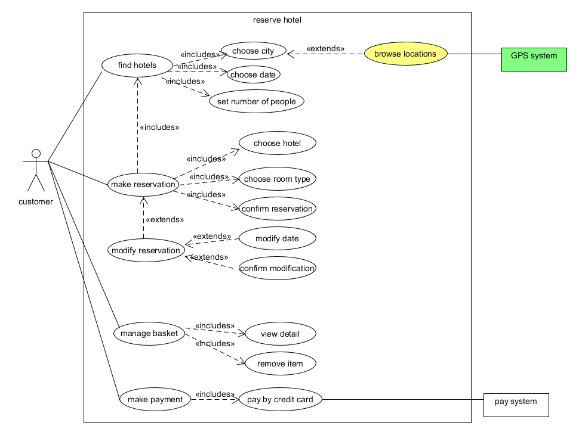
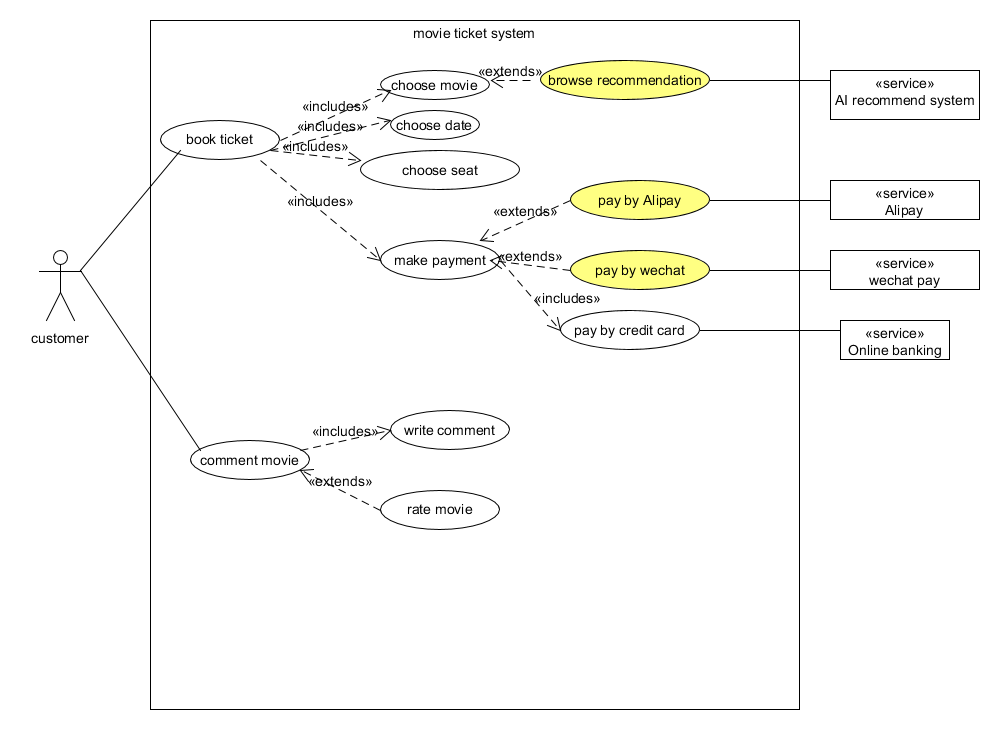

## 1、简答题

### 1. 用例的概念

用例（英语：use case），或译使用案例、用况，是软件工程或系统工程中对系统如何反应外界请求的描述，是一种通过用户的使用场景来获取需求的技术。每个用例提供了一个或多个场景，该场景说明了系统是如何和最终用户或其它系统互动，也就是谁可以用系统做什么，从而获得一个明确的业务目标。编写用例时要避免使用技术术语，而应该用最终用户或者领域专家的语言。用例一般是由软件开发者和最终用户共同创作的。

### 2. 用例和场景的关系？什么是主场景或 happy path？

- 系统根据参与者的请求，在不同的条件下，执行某一行为序列。每一个行为序列可称为一个场景。一个用例包含多个场景，场景也可以称为用例的一个实例。

- 主场景（happy path）描述了满足涉众关注点的典型成功路径。它是典型的、无条件的、理想方式的主成功场景。主场景是用户和系统之间的主要交互，是最常用的实现用户目标的场景。

### 用例有哪些形式？

- 摘要：简洁的一段式概要，通常用于主成功场景。在早期需求分析过程中，为快速了解主题和范围，通常花费少量时间快速编写。

- 非正式形式：非正式的段落格式，用几个段落覆盖不同的场景。

- 详述：详细编写所有步骤和各种变化，同时具有补充部分，如前置条件和成功保证。确定并以摘要形式编写大量用例后，在第一次需求讨论中，详细地编写其中少量的具有重要架构意义和高价值的用例。

  

### 对于复杂业务，为什么编制完整用例非常难？

- 对于复杂业务，其涉及的场景数量会变得很多，而各场景之间的关联使得用例设计变得特别困难。因为用例是各个成功与失败场景的集合，用例的编写需要对这些场景熟悉，并且需要建模知识与注意用户交互的相关细节，但仍无法完整地覆盖实际中可能出现的情况。用例总是不完整的，所以编制完整用例非常难。

### 什么是用例图？

- 用例图是一种优秀的系统语境图，它能够展示系统边界，位于边界之外的事物以及系统如何被使用。它可以作为沟通的工具，用以概括系统以及其参与者的行为。

- **用例图**是指由参与者（Actor）、**用例**（Use Case），边界以及它们之间的关系构成的用于描述系统功能的视图。 **用例图**（User Case）是外部用户（被称为参与者）所能观察到的系统功能的模型**图**。

### 用例图的基本符号与元素？

- **参与者(Actor)**

表示与您的应用程序或系统进行交互的用户、组织或外部系统。用一个**小人**表示。

- **用例(Use Case)**

用例就是外部可见的系统功能，对系统提供的服务进行描述。 用**椭圆**表示

- **系统边界**

指系统与系统之间的界限。把系统边界以外的同系统相关联的其他部分称为系统环境。在UML图中用一个**矩形**表示。

- **关系**

  用例图中涉及的关系有：关联、泛化、包含、扩展；

  - 关联(*Association*)

    表示参与者和用例之间的交互。为通信途径，任何一方都可发送或可接收消息。箭头指向：指向消息接收方。在UML中用直线表示：

    

  - 泛化(*Inheritance*)

    就是通常理解的继承关系，子用例和父用例相似，但表现出更特别的行为；子用例将继承父用例的所有结构、行为和关系。子用例可以使用父用例的一段行为，也可以重载它。父用例通常是抽象的。箭头指向的是父用例。

    

  - 包含(*Include*)

    包含关系用来把一个较复杂用例所表示的功能分解成较小的步骤，箭头指向被包含的用例。

    

  - 扩展(*Extend*)

    扩展关系是指 用例功能的延伸，相当于为基础用例提供一个附加功能。箭头指向基用例。

    

### 用例图的画法与步骤

- 创建新用例图
- 绘制用例图
  - 绘制“子系统”边界
    - 重命名“子系统”
  - 绘制参与者（放在所有系统边界之外）
    - 重命名参与者
  - 绘制用例
    - 使用参与者自身能够理解的名称重命名用例，不要使用与代码有关的名称
    - 从主要的事务开始，直到后面较小的交互为止
    - 将每个用例放入支持它的系统或主要子系统（忽略只与用户有关的外观或组件）
    - 可以在系统边界外绘制用例，表明系统不支持该用例
  - 将参与者与用例相连
  - 使用“包括”、“扩展”和“泛化”关系结构化用例

### 用例图给利益相关人与开发者的价值有哪些？

- 对于利益相关人：可以直观看到系统的结果和用户的功能体验，保证系统按照用户的需求进行设计；用例能够根据需要对复杂程度和形式化程序进行增减调节，即能够响应用户（利益相关人）提出的需求，而用例图使得这种调节更加便利，可通过修改图形间的关系实现。

- 对于开发者：用例图是设计者设计过程的结论和参考，设计者与开发者之间的交流工具，开发者开发过程的蓝图；用例图使得开发者能够更明确地获得需求，更好地理解需求；用例图可以指导开发和测试，同时可以在整个过程中对其他工作流起到指导作用。

## 2、建模练习题（用例模型）

- 选择2-3个你熟悉的类似业务的在线服务系统（或移动 APP），如定旅馆（携程、去哪儿等）、定电影票、背单词APP等，分别绘制它们用例图。并满足以下要求：

  - 请使用用户的视角，描述用户目标或系统提供的服务
  - 粒度达到子用例级别，并用 include 和 exclude 关联它们
  - 请用色彩标注出你认为创新（区别于竞争对手的）用例或子用例
  - 尽可能识别外部系统和服务

  选择定旅馆系统：

  

  定电影票系统：

  

- 然后，回答下列问题：

  1. **为什么相似系统的用例图是相似的？**

     相似系统面对的参与者和用例是相似的，用例之间的关系也是同构的。用户预期的功能都是相似的，即不同的同类系统一定具有一致基本功能以及带有自己特色的扩展功能。所以体现在用例图上也是相似的。

     

  2. **如果是定旅馆业务，请对比 Asg_RH 用例图，简述如何利用不同时代、不同地区产品的用例图，展现、突出创新业务和技术**

     不同时代对预定的酒店的需求不同。可以让筛选算法与时俱进，满足一些不同的主流要求。且用户会需要更加优秀、好用、有参考价值的评价系统，也需要随时更新。而不同地区的消费特点不同，旅游胜地和普通城市用户对于酒店预订的需求有差别，可以在用例图上突出一些特点。

     

  3. **如何利用用例图定位创新思路（业务创新、或技术创新、或商业模式创新）在系统中的作用**

     应该通过创新点在图中的位置来判断。如果创新位于较高的父级，则作用比较大。如果是子类或者是被包括的关系，则作用相对较小。

     

  4. **请使用 SCRUM 方法，选择一个用例图，编制某定旅馆开发的需求（backlog）开发计划表**

     | ID   | name     | Imp  | Est  | How to demo                                                  | Notes                                              |
     | ---- | -------- | ---- | ---- | ------------------------------------------------------------ | -------------------------------------------------- |
     | 1    | 旅馆查询 | 5    | 4    | 通过GPS或者用户自行选择位置，利用地图或者列表信息进行一定范围内酒店信息查询 | 通过GPS的API 定位                                  |
     | 2    | 旅馆选择 | 5    | 8    | 用户可以利用酒店的房间数、房间大小、酒店评价等信息进行酒店的选定 | 酒店信息的实时更新                                 |
     | 3    | 房间预定 | 15   | 8    | 选定酒店后需要进行房间的预定，用户输入入住者的身份证号码、是否需要保险、手机号码等必要信息后创建订单 | 需要检测信息的有效性                               |
     | 4    | 订单管理 | 20   | 6    | 用户在创建订单后可以对订单信息进行修改，比如取消订单，修改入住天数以及添加备注等 | 特价房间不能取消订单，只能提示用户通过保险公司理赔 |
     | 5    | 费用支付 | 20   | 3    | 特价房间不能取消订单，只能提示用户通过保险公司理赔           | 可以通过微信、支付宝、银联进行订单支付             |
     | 6    | 账户管理 | 10   | 4    | 用户进行头像、昵称、身份信息、预留手机等个人信息的修改       | 需要检测信息的有效性                               |

  5. **根据任务4，参考 [使用用例点估算软件成本](https://www.ibm.com/developerworks/cn/rational/edge/09/mar09/collaris_dekker/index.html)，给出项目用例点的估算**

     

     | 用例     | 事务 | 计算 | 原因                 | UC 权重 |
     | -------- | ---- | ---- | -------------------- | ------- |
     | 酒店查询 | 3    | 3    | 查询方式多种         | 简单    |
     | 酒店筛选 | 6    | 5    | 及时更新酒店各项信息 | 一般    |
     | 酒店预订 | 3    | 2    | 录入信息创建订单     | 一般    |
     | 订单管理 | 5    | 3    | 修改、取消           | 简单    |
     | 订单支付 | 1    | 1    | 调用外部api          | 简单    |
